# Employee Management System Guide

## Overview
This guide focuses on the employee lifecycle management within a Blazor web application. It covers Create, Read, Update, and Delete (CRUD) operations for employees.

### System Architecture Layers
The application follows a layered architecture:
- **Blazor UI**: User interface components and forms
- **API Layer**: RESTful endpoints (EmployeesController)
- **Service Layer**: Business logic (IEmployeeService / EmployeeService)
- **Repository Layer**: Data access (EmployeeRepository / BaseRepository)
- **Entity Framework Core**: ORM and database interactions (ApplicationDbContext)

### Key Symbols Used
- ✓ = Success / Data saved
- ⚠ = Validation warning or error
- ✉ = Notification or email
- ➜ = Request or action initiated
- ⟳ = Update or change
- ⛔ = Denied or error

## Key Files to Reference
- **API**: `EmployeeManagement.API\Controllers\EmployeesController.cs`
- **Service**: `EmployeeManagement.Infrastructure\Services\EmployeeService.cs`, `EmployeeManagement.Infrastructure\Interfaces\IEmployeeService.cs`
- **Repository**: `EmployeeManagement.Infrastructure\Repositories\EmployeeRepository.cs`, `EmployeeManagement.Infrastructure\Repositories\BaseRepository.cs`
- **Entity/Configuration**: `EmployeeManagement.Core\Entities\Employee.cs`, `EmployeeManagement.Infrastructure\Data\Configurations\EmployeeConfiguration.cs`
- **DTO**: `EmployeeManagement.Core\DTOs\Requests\CreateEmployeeRequest.cs`
- **Database Context**: `EmployeeManagement.Infrastructure\Data\ApplicationDbContext.cs`

## Actors
- **User**: Employee or administrator interacting with the system
- **Blazor UI**: Frontend components handling user input and display
- **System Components**: API, services, repositories, and database as described above

## CRUD Workflows

### 1. Create Employee
**Purpose**: Add a new employee to the system.

1. **UI Step**: User fills out the CreateEmployee form and submits it.
2. **API Step**: The `POST /api/employees` endpoint in EmployeesController receives the request and maps the DTO.
3. **Service Step**: EmployeeService.CreateEmployeeAsync() validates business rules:
   - Checks for unique employee number
   - Ensures required fields are present
4. **Repository Step**: EmployeeRepository.CreateEmployeeAsync() calls BaseRepository.AddAsync(employee).
5. **Database Step**: ApplicationDbContext.SaveChanges() persists the record.
6. **UI Feedback**: Displays success (✓) or validation errors (⚠).

### 2. Read Employees
**Purpose**: Retrieve and display employee information.

1. **UI Step**: User requests a list or specific employee details.
2. **API Step**: Handles `GET /api/employees` (list) or `GET /api/employees/{id}` (single).
3. **Service/Repository Step**: Calls GetEmployeesAsync() or GetEmployeeByIdAsync() through the repository layer.
4. **UI Display**: Shows the retrieved data.

### 3. Update Employee
**Purpose**: Modify existing employee information.

1. **UI Step**: User edits the employee form and submits changes.
2. **API Step**: `PUT /api/employees/{id}` endpoint validates the ID and ownership.
3. **Service Step**: Validates changes, such as position updates or manager assignments.
4. **Repository Step**: UpdateAsync(employee) persists changes via SaveChanges().
5. **UI Feedback**: Notifies user of success (✓).

### 4. Delete Employee
**Purpose**: Remove an employee from the system (often soft delete).

1. **UI Step**: User initiates delete action and confirms.
2. **API Step**: `DELETE /api/employees/{id}` endpoint processes the request.
3. **Service Step**: Checks permissions and dependent data (e.g., attendance, timesheets).
4. **Repository Step**: DeleteAsync(id) may set IsDeleted flag instead of hard delete.
5. **Database Step**: SaveChanges() applies the deletion.
6. **UI Feedback**: Shows result (✓ for success, ⛔ for errors).

## Common Validations and Best Practices
- **Unique Employee Number**: Ensure no duplicates before creating or updating.
- **Manager Relationships**: Verify manager exists and prevent circular references.
- **Soft Deletes**: Use IsDeleted flag if other tables reference the employee.
- **DTO Mapping**: Always map DTOs to entities in the controller/service layer; never accept raw entities from UI.
- **Data Integrity**: Validate all inputs and handle exceptions gracefully.

## Sequence Diagram: Create Employee

```mermaid
sequenceDiagram
    participant UI as Blazor UI
    participant API as EmployeesController
    participant Service as EmployeeService / IEmployeeService
    participant Repo as EmployeeRepository / BaseRepository
    participant DB as ApplicationDbContext

    UI->>API: POST /api/employees (CreateEmployeeRequest) ➜
    API->>Service: Validate & map DTO to Employee
    Service->>Repo: CreateEmployeeAsync(employee)
    Repo->>DB: Add entity & SaveChanges()
    DB-->>Repo: Persisted (Id) ✓
    Repo-->>Service: Return created entity
    Service-->>API: Return created DTO (201 Created)
    API-->>UI: Show success ✓
```



## Quick Checklist Before Coding/Reviewing
- [ ] Controller uses DTOs and delegates to service layer.
- [ ] Service enforces business rules and handles DTO ↔ entity mapping.
- [ ] Repository focuses only on data persistence concerns.
- [ ] EmployeeConfiguration defines constraints like field lengths and indexes.
- [ ] Unit tests cover EmployeeService rules and API integration tests are in place.

## Unit Testing Guide

### What Are We Testing?

We are testing the EmployeeService class.

This class performs three main functions:

1. Interacts with the repository to access the database.
2. Uses AutoMapper for object mapping.
3. Returns EmployeeDto objects.

In unit testing, we focus on:

- Avoiding real database interactions.
- Testing only the service logic.

To achieve this, we use Moq to mock the database.

### Important Concept: Mocking the Database

- ❌ Real database: Not used.
- ✅ Fake database: Preferred.

Reasons:
- No need for SQL.
- No database tables required.
- Tests run faster.
- No connection strings needed.

We use: `Mock<IBaseRepository<Employee>>`

This tells C# to pretend we have a database and return values as specified.

### The 3 Steps to Write Any Test

Remember these three words:

1. Arrange
2. Act
3. Assert

#### 1. Arrange (Setup / Prepare)

In this step:
- Create fake employees.
- Configure the mock repository to return specific values.

Example:

```csharp
var employee = new Employee { Id = 1, FirstName = "John" };
_baseRepositoryMock.Setup(r => r.AddAsync(employee))
                   .ReturnsAsync(employee);
```

This means: If someone tries to add this employee, pretend it succeeds and return it.

#### 2. Act (Call the Method)

Call the service method you want to test:

```csharp
var result = await _employeeService.CreateEmployeeAsync(employee);
```

This is the "action" step.

#### 3. Assert (Check the Result)

Verify if the result is correct.

Example:

```csharp
Assert.That(result.FullName, Is.EqualTo("John Doe"));
```

This checks: Did the service produce the expected output?

### In Simple English

Testing is like a science experiment:

- Arrange: 🥼 Set up your tools and materials.
- Act: ⚗️ Perform the experiment.
- Assert: 📏 Check the results.

### Why Mocking Is Needed?

When the service tries to save data:

```csharp
repository.AddAsync(employee);
```

We don't want:
- ❌ Real database.
- ❌ Real SQL.

So we mock it:

```csharp
_baseRepositoryMock.Setup(r => r.AddAsync(employee));
```

Moq pretends to be a database.

### How to Create Your Own Test

Think step by step.

Example: Test that employee salary should be updated.

1. Arrange:
   - Create fake employee: `var employee = new Employee { Salary = 1000 };`
   - Update salary: `employee.Salary = 5000;`
   - Mock update: `_baseRepositoryMock.Setup(r => r.UpdateAsync(employee)).ReturnsAsync(employee);`

2. Act:
   - `var result = await _employeeService.UpdateEmployeeAsync(employee);`

3. Assert:
   - `Assert.That(result.Salary, Is.EqualTo(5000));`

And you've created a test case!

### Thinking Pattern

Whenever you want to test:

"If I give THIS input… service should return THAT output."

Examples:
- If employee id = 1 → return John.
- If employee id not found → return null.
- If deleted id = 1 → return true.
- If deleted id = 99 → return false.
- If full name → "First Last".

Translate to:
- Arrange: Create that scenario.
- Act: Call the method.
- Assert: Verify expected outcome.

### Another Example: Delete Employee Fails

- Arrange: `_baseRepositoryMock.Setup(r => r.DeleteAsync(5)).ReturnsAsync(false);`
- Act: `var result = await _employeeService.DeleteEmployeeAsync(5);`
- Assert: `Assert.False(result);`

You've written another test case!

### Summary

- Fake the database using Moq.
- Test only the service logic.
- Always follow 3 steps: Arrange, Act, Assert.

### Practice by Writing Tests For

- Salary update
- Position update
- Invalid email
- Employees count
- Name mapping
- Delete fails
- Manager id is null

### Final Tip

When you think: "What should happen if…"

Turn that into:
- Arrange → Create that scenario
- Act → Call method
- Assert → Verify expected outcome
